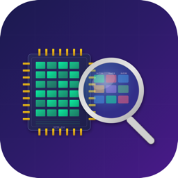
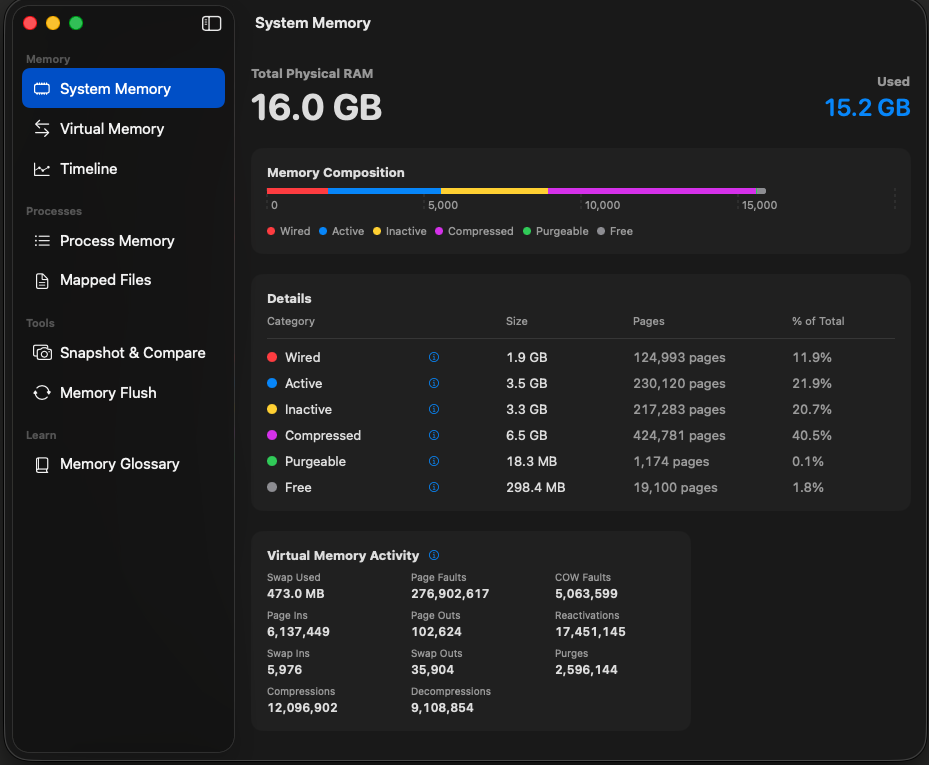
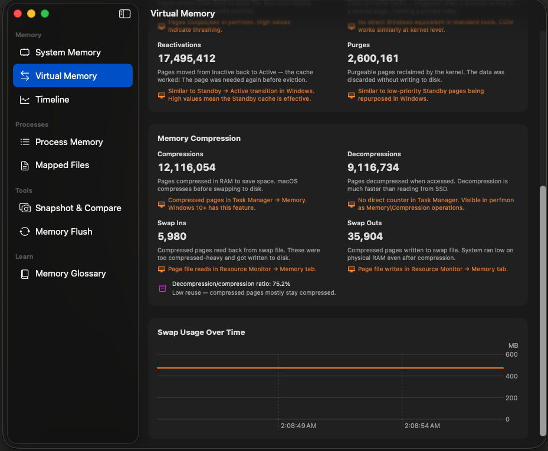
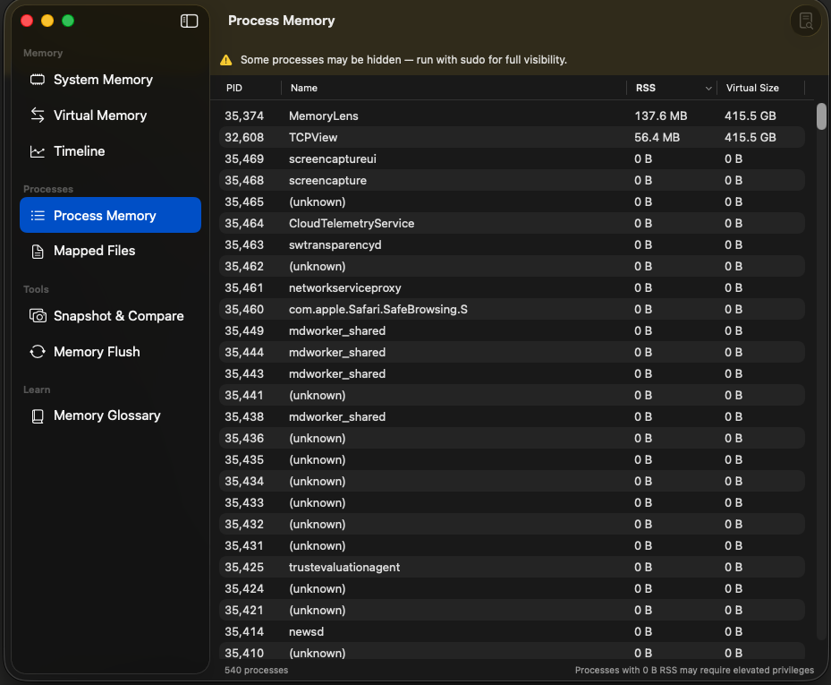
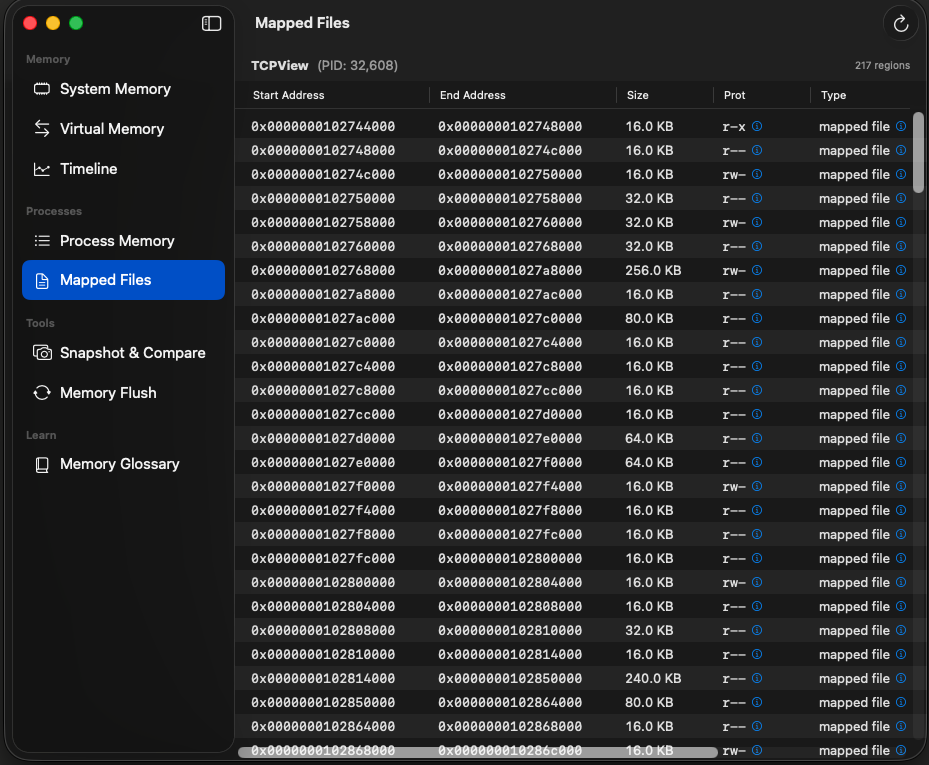
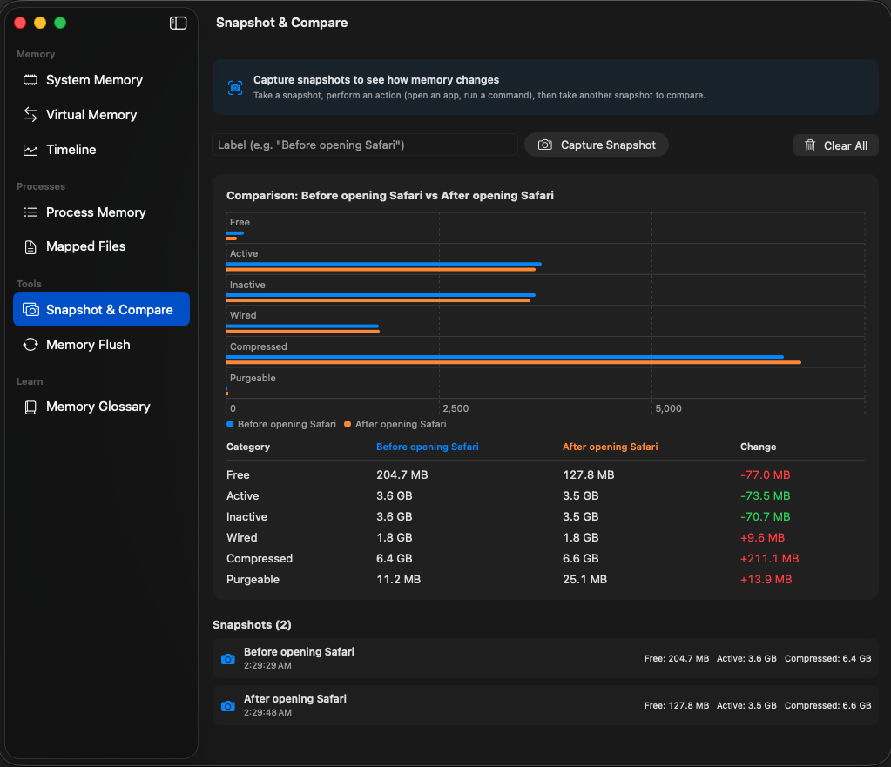
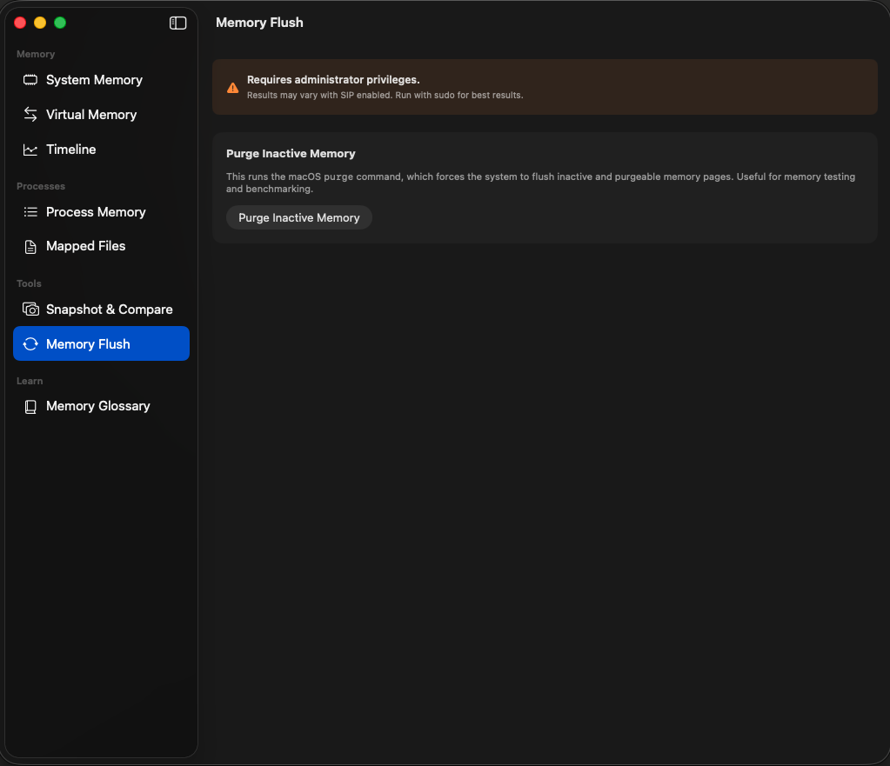
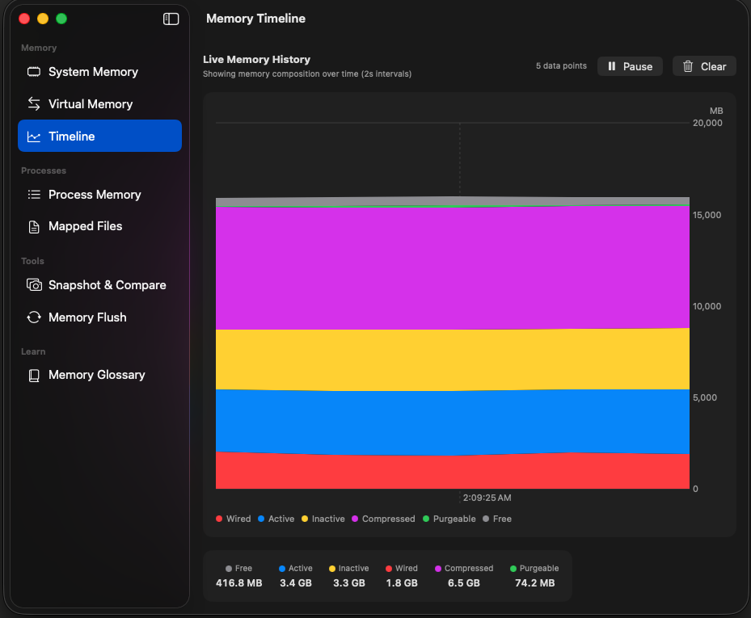

<p align="center">
  
</p>

<h1 align="center">MemoryLens</h1>

<p align="center">
  <strong>A native macOS app for exploring and understanding memory internals</strong><br>
  Built for learning, not just monitoring.
</p>

<p align="center">
  
  
  
  
</p>

---

MemoryLens exposes the same Mach kernel APIs that power Activity Monitor and `vmstat`, but wraps them in an educational interface with contextual explanations, Windows comparisons, and interactive tools for experimentation.

Designed for people who want to understand *how* memory works, not just *how much* is used.

---

## Screenshots

### System Memory
Live physical RAM breakdown with a stacked bar chart, detailed stats table, and virtual memory activity counters — all refreshing every 2 seconds.



Every memory category (Wired, Active, Inactive, Compressed, Purgeable, Free) has a blue **info button** that opens a popover explaining:
- What it means on macOS
- Its Windows equivalent (mapped to Task Manager concepts)
- A deep-dive tip for further learning

---

### Virtual Memory
Dedicated view showing paging, swapping, and compression activity since boot. Each metric includes a plain-English explanation and its Windows/perfmon equivalent.



Key stats include: page faults, page ins/outs, COW faults, reactivations, compression/decompression counts, swap ins/outs, and a live swap usage chart.

---

### Process Memory
Sortable table of all running processes with PID, name, RSS (resident set size), and virtual memory size. Click any column header to re-sort.



> **Note:** Without root privileges, some processes will show 0 B for memory usage. Run with `sudo` for complete visibility — a yellow banner reminds you of this.

---

### Mapped Files
Select a process and inspect its full virtual memory map — every region with start/end addresses in hex, size, protection flags (r/w/x), region type, and mapped filename.



Protection flags and region types have **info buttons** explaining concepts like `__TEXT` (executable code), `__DATA` (mutable globals), copy-on-write, and W^X enforcement — with Windows PE section equivalents.

---

### Snapshot & Compare
Capture memory state before and after an action to see exactly what changed.



**How to use:**
1. Type a label (e.g., "Before opening Safari") and click **Capture Snapshot**
2. Perform an action — open an app, close tabs, run a command
3. Capture another snapshot with a new label
4. See a side-by-side bar chart and delta table showing changes across all memory categories

Color-coded deltas: **green** = improvement, **red** = increased pressure.

---

### Memory Flush
Run the macOS `purge` command to flush inactive and purgeable memory, with before/after comparison.



Requires administrator privileges (`sudo`). Results may vary with SIP enabled. The app handles errors gracefully — if purge fails, you'll see a clear error message instead of a crash.

---

## Memory Glossary

A searchable, built-in reference covering 16 core memory concepts organized into three sections:

| Section | Concepts |
|---|---|
| **Core Concepts** | Virtual vs Physical Memory, Page Size, Memory Pressure |
| **System Memory** | Wired, Active, Inactive, Compressed, Purgeable, Free |
| **Process Regions** | \_\_TEXT, \_\_DATA, Heap, Stack, Dynamic Libraries, Anonymous Memory, Protection Flags |

Every entry includes a macOS explanation, the **Windows equivalent** (mapped to Task Manager and perfmon), and a deep-dive note.

---

## Timeline

Live stacked area chart recording memory composition over time at 2-second intervals (up to 5 minutes of history). Pause, resume, and clear. Great for watching what happens to memory when you open or close applications.



---

## Requirements

- macOS 13.0 (Ventura) or later
- Xcode 15+ with Swift 5.9+
- No third-party dependencies — Darwin, Foundation, SwiftUI, and Swift Charts only

### Privilege Levels

| Feature | Without root | With root (`sudo`) |
|---|---|---|
| System Memory | Full access | Full access |
| Virtual Memory | Full access | Full access |
| Timeline | Full access | Full access |
| Process Memory | Own processes only | All processes |
| Mapped Files | Own processes only | All processes |
| Memory Flush | Fails gracefully | Full access |

---

## Building

```bash
# Install xcodegen if needed
brew install xcodegen

# Clone and build
git clone https://github.com/mahatab/MemoryLens.git
cd MemoryLens
xcodegen generate
xcodebuild -project MemoryLens.xcodeproj -scheme MemoryLens build
```

Or open in Xcode:

```bash
open MemoryLens.xcodeproj
```

### Running with full access

```bash
# Find the built executable
sudo ~/Library/Developer/Xcode/DerivedData/MemoryLens-*/Build/Products/Debug/MemoryLens.app/Contents/MacOS/MemoryLens
```

---

## Project Structure

```
MemoryLens/
├── MemoryLensApp.swift              # App entry point
├── ContentView.swift                # Sidebar navigation (NavigationSplitView)
├── MemoryLens.entitlements          # Sandbox disabled for Mach API access
├── Assets.xcassets/                 # App icon
├── Services/
│   ├── MemoryStatsService.swift     # host_statistics64 + host_info + swap usage
│   ├── ProcessListService.swift     # proc_listallpids + task_for_pid + task_info
│   └── VMRegionService.swift        # mach_vm_region + proc_regionfilename
├── Views/
│   ├── SystemMemoryView.swift       # RAM breakdown with stacked bar chart
│   ├── VirtualMemoryView.swift      # VM paging/swap/compression stats
│   ├── TimelineView.swift           # Live memory history area chart
│   ├── ProcessMemoryView.swift      # Sortable process table
│   ├── MappedFilesView.swift        # VM regions for a selected process
│   ├── SnapshotCompareView.swift    # Before/after memory comparison
│   ├── MemoryFlushView.swift        # Purge command with delta display
│   ├── GlossaryView.swift           # Searchable memory concepts reference
│   └── ConceptPopover.swift         # Reusable info popover component
└── Helpers/
    ├── ByteFormatter.swift          # Human-readable byte formatting
    └── MemoryEducation.swift        # All educational content + Windows mappings
```

---

## Mach APIs Used

| API | Purpose |
|---|---|
| `host_statistics64(HOST_VM_INFO64)` | System memory stats — free, active, inactive, wired, compressed, purgeable, page faults, compressions, swap activity |
| `host_info(HOST_BASIC_INFO)` | Total physical RAM |
| `sysctlbyname("vm.swapusage")` | Swap file usage |
| `proc_listallpids()` | Enumerate all process IDs |
| `proc_name()` | Get process name from PID |
| `task_for_pid()` + `task_info(MACH_TASK_BASIC_INFO)` | Per-process RSS and virtual size |
| `mach_vm_region(VM_REGION_BASIC_INFO_64)` | Walk virtual memory regions |
| `proc_regionfilename()` | Get mapped filename for a VM region |
| `vm_page_size` | System page size for page-to-byte conversion |

All APIs are called directly from Swift via `import Darwin` — no bridging headers or C wrappers needed.

---

## Learning Resources

MemoryLens is designed to complement these resources:

- **macOS**: `man vm_stat`, `man purge`, `man mach_vm_region`
- **Concepts**: [Mac OS X Internals (Singh)](https://www.amazon.com/Mac-OS-Internals-Systems-Approach/dp/0321278542), [Windows Internals (Russinovich)](https://learn.microsoft.com/en-us/sysinternals/resources/windows-internals)

---

## License

MIT License — see [LICENSE](LICENSE) for details.
